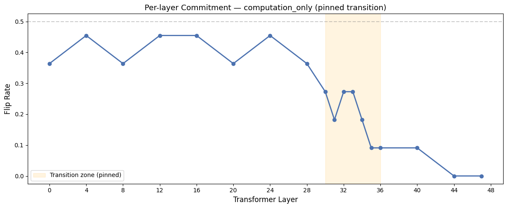

<div align="center">
  <h1>🧠 Chain-of-Thought Commitment Points</h1>
  <p><em>Mechanistic Interpretability of Latent Reasoning in Large Language Models</em></p>
  
  [](https://huggingface.co/Qwen/Qwen2.5-14B-Instruct)
  [](https://huggingface.co/datasets/DigitalLearningGmbH/MATH-lighteval)
  []()
</div>

<br/>

## 📖 Overview

How does a Large Language Model (LLM) utilizing Chain-of-Thought (CoT) prompting arrive at a mathematical conclusion? Does it "know" the answer from the first generated token, or does the reasoning process dynamically compute the result in the intermediate layers?

This repository investigates the **Commitment Point** of LLMs—the precise mechanistic moment where the model's internal probability distribution irrevocably collapses onto a specific terminal answer. 

By employing a novel macroscopic activation patching technique called **"Truncate & Generate"**, we bypass the token alignment destruction typical of standard patching and successfully map the sequence-level and layer-level causality of mathematical reasoning.

## 🚀 Key Discovery: The Functional Rift

Our most significant finding is the empirical mapping of a **"Functional Rift"** across the transformer layers (Qwen2.5-14B-Instruct). By causally intervening on the `computation` semantic tokens across 48 transformer layers, we discovered a distinct tripartite architecture of commitment:

<div align="center">
  
</div>

1. **The Plateau (Layers 0–28): Semantic Steering**
   - Intervening on computational tokens in these early/mid layers successfully flips the model's terminal answer ~36-45% of the time. These layers act as a scratchpad, reading in the algebraic context and assembling semantic meaning.
2. **The Transition Zone (Layers 30–35): The Collapse**
   - We isolated the commitment drop to a precise 4-layer window. Here, the latent probability distribution collapses. 
3. **The Cliff (Layers 44–47): Causal Locking**
   - At the final layers, the flip rate hits a hard $0\%$. The model is completely locked into its trajectory. Even if we inject correct mathematical reasoning into the residual stream, the late layers ignore it and rigidly project the in-context prior into the original incorrect vocabulary output.

This confirms the bipartite theory of transformer layer function (Dutta et al.) on a complex mathematical reasoning task.

## 🔬 Methodology: Truncate & Generate

Traditional activation patching suffers from catastrophic alignment failure when dealing with variable-length CoT reasoning traces. We solved this by operating at the macro-sequence level:

1. **Semantic Segmentation:** We parse reasoning traces into strict functional masks (`setup`, `computation`, `transition`, `conclusion`).
2. **Truncation:** We truncate a trace leading to a *wrong* answer ($T_{wrong}$) immediately after a computational step.
3. **Injection:** We inject the hidden state activations from an identical step in a *correct* trace ($T_{correct}$).
4. **Generation:** We allow the model to freely generate from that boundary to the end, measuring the **Flip Rate** (the probability it corrects itself).

To ensure extreme rigor, our final experimental suite includes a **6-Block Ablation Suite**, notably featuring a *Cross-Problem Control* that proves the flips are driven by genuine semantic steering, not merely attention disturbance.

## 📂 Repository Structure

The repository is structured to provide a clean, linear history of the research evolution.

```
cot/
├── notebooks/
│   ├── v1_prototype_gsm8k/      # Early GSM8K prototypes (superseded)
│   ├── v2_math_development/     # MATH dataset migration & T&G paradigm development
│   └── v3_current/              # Final N=40 Execution and Block D Pinning runs
├── docs/                        # 📚 Comprehensive Technical Documentation Suite
│   ├── 01_theory_and_architecture.md
│   ├── 02_methodology_and_codebase.md
│   ├── ...
├── final/                       # Raw results, complete execution notebook, and plots
└── jounels/                     # Researcher development logs and pilot reports
```

## 📖 Deep Dive Documentation

For a comprehensive understanding of the formalisms, mathematical proofs, and code architecture, see the `docs/` suite:

1. [Theory and Architecture](docs/01_theory_and_architecture.md)
2. [Methodology and Codebase](docs/02_methodology_and_codebase.md)
3. [Results and Future Directions](docs/03_results_and_future_directions.md)
4. [Deep Logical Audit & Final Architecture](docs/04_deep_logical_audit_and_final_architecture.md)
5. [Experiment Evolution History](docs/05_experiment_evolution_history.md)
6. [Conference Paper Outline](docs/06_paper_outline.md)

## ⚙️ Reproducibility

To reproduce the final functional rift finding:
1. Ensure access to a GPU with at least 16GB VRAM (e.g., NVIDIA T4) to load Qwen2.5-14B-Instruct in NF4 quantization.
2. Open `final/notebooke66c37d069.ipynb` (the most complete run including Block D).
3. The notebook is self-contained. Run all cells sequentially. 
4. Full execution of the 6-block suite takes approximately 1.5 - 2 hours on a single T4.

---
*This research was conducted as part of an investigation into the mechanistic interpretability of latent reasoning.*
